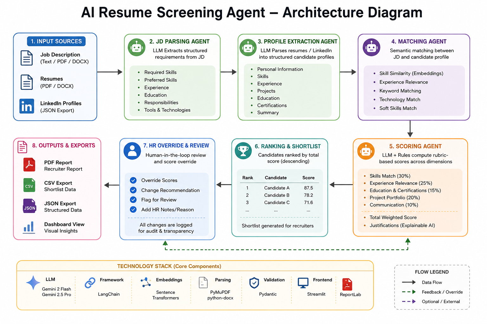
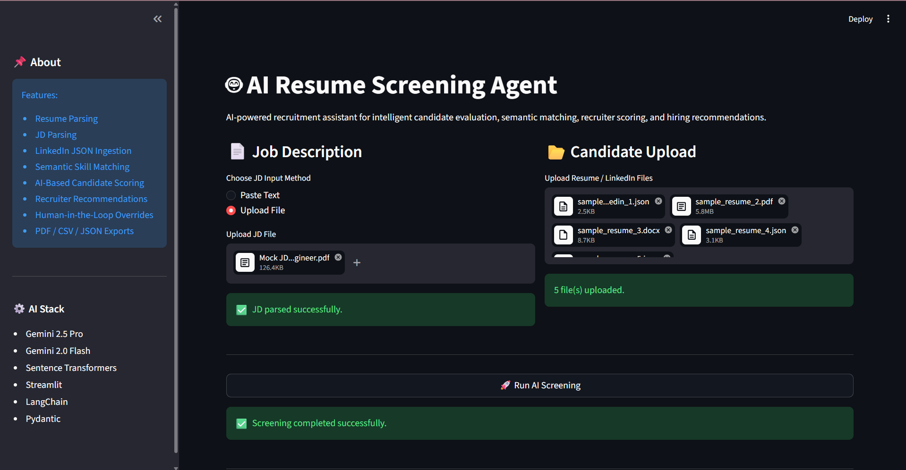
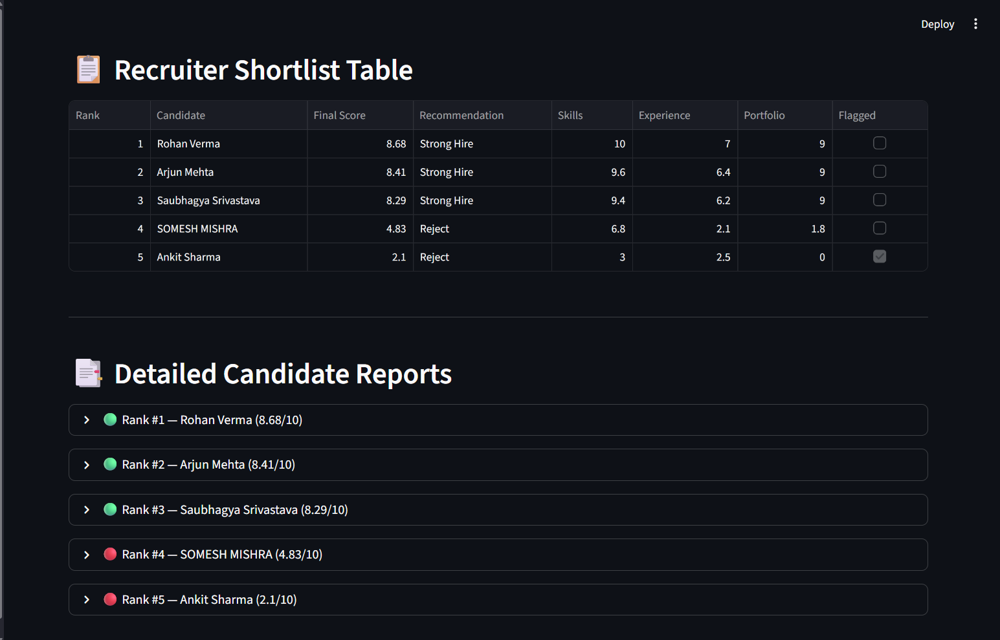
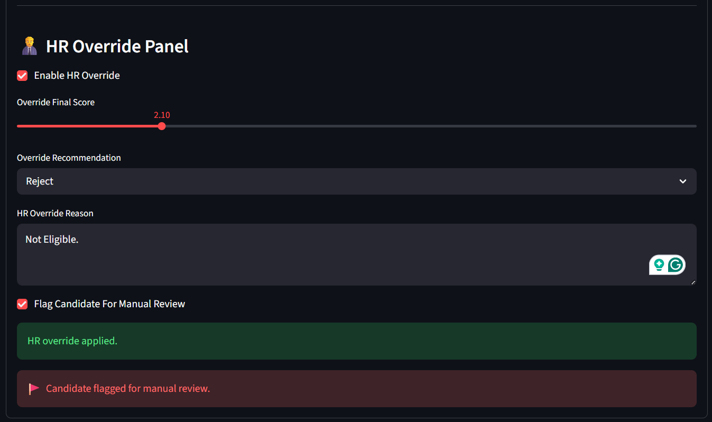
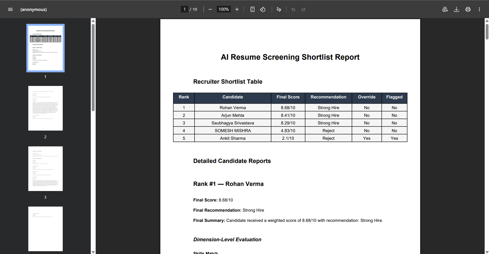

# AI Resume Screening Agent

An AI-powered recruitment assistant designed to help HR teams evaluate candidates using structured resume parsing, semantic matching, explainable AI scoring, recruiter-style ranking, and human-in-the-loop review workflows.

This project was developed as part of an AI Enablement Internship assignment focused on building an intelligent, modular, and explainable resume screening pipeline.

---

# Assignment Objectives Covered

This project successfully implements all major assignment requirements.

## Core Requirements Implemented
- Job Description (JD) Parsing Agent
- Resume Parsing Agent
- Candidate Ranking Pipeline
- Semantic Skill Matching
- Explainable AI Scoring
- Recruiter Recommendation System
- Streamlit-Based User Interface
- PDF/DOCX Resume Support
- Structured Candidate Evaluation
- Exportable Recruiter Reports

---

## Advanced Features Implemented
- LinkedIn JSON Ingestion
- Human-in-the-Loop HR Override Workflow
- Candidate Flagging for Manual Review
- Semantic Experience Relevance Scoring
- AI-Based Project Portfolio Evaluation
- Multi-Format Candidate Ingestion
- Structured Pydantic Validation
- Explainable Dimension-Level Justifications
- Recruiter Shortlist Table
- Final Recruiter-Approved Report Generation

---

# Features

## AI-Powered Candidate Evaluation
- Job Description Parsing Agent
- Resume Parsing Agent
- Structured Candidate Profile Extraction
- Semantic Skill Matching
- Experience Relevance Scoring
- AI-Based Project Portfolio Evaluation
- Explainable Dimension-Level Scoring
- Recruiter-Aware Candidate Ranking

---

## Multi-Format Resume Support
- PDF Resume Support
- DOCX Resume Support
- LinkedIn JSON Profile Support

---

## Human-in-the-Loop Recruiter Workflow
- Recruiter Shortlist Table
- HR Override System
- Candidate Flagging for Manual Review
- Final Recruiter-Approved Scores
- Override Reason Tracking
- Explainable AI Recommendations

---

## Export System
- PDF Recruiter Reports
- CSV Shortlist Export
- JSON Structured Export

---

## AI & Validation Features
- Gemini AI Integration
- LangChain Prompt Orchestration
- Semantic Embedding Matching
- Pydantic Validation
- Structured JSON Enforcement
- Robust Parsing & Normalization

---

# Evaluation Dimensions

Candidates are evaluated across multiple dimensions:

| Dimension | Weight |
|---|---|
| Skills Match | 30% |
| Experience Relevance | 25% |
| Education & Certifications | 15% |
| Project Portfolio | 20% |
| Communication Quality | 10% |

The system generates:
- dimension-level scores,
- weighted total score,
- recruiter recommendation,
- explainable justifications.

---

# System Architecture



---

# Architecture Flow

```text
Job Description
        ↓
JD Parsing Agent
        ↓
Resume / LinkedIn Parsing
        ↓
Structured Candidate Extraction
        ↓
Semantic Skill Matching
        ↓
Experience & Portfolio Scoring
        ↓
Recruiter Ranking
        ↓
HR Override & Manual Review
        ↓
PDF / CSV / JSON Export
```

---

# Technical Stack & Decision Log

## LLM Selection Strategy

### Why Gemini 2 Flash?

Gemini 2 Flash was selected as the primary LLM due to its fast inference speed, high request throughput, and strong structured extraction capabilities. The project involves repeated resume parsing and candidate evaluation workflows, where low latency and scalability are more important than deep multi-step reasoning.

Gemini 2 Flash provided an optimal balance between:
- performance,
- cost efficiency,
- structured JSON reliability,
- and real-time responsiveness.

It was primarily used for:
- JD parsing,
- resume profile extraction,
- structured candidate data generation,
- and high-frequency inference tasks.

---

### Why Gemini 2.5 Pro?

Gemini 2.5 Pro was used for higher-quality reasoning and deeper semantic evaluation tasks where richer contextual understanding was required.

While Gemini 2 Flash performs efficiently for extraction workflows, Gemini 2.5 Pro demonstrated stronger:
- reasoning quality,
- contextual interpretation,
- project evaluation capability,
- and nuanced justification generation.

Gemini 2.5 Pro was specifically used for:
- candidate evaluation summaries,
- project portfolio assessment,
- recruiter-style reasoning,
- and explainable scoring generation.

---

### Hybrid LLM Strategy

The system uses a hybrid LLM architecture:

- **Gemini 2 Flash** → high-throughput structured extraction tasks
- **Gemini 2.5 Pro** → advanced reasoning and candidate evaluation

This separation improved:
- inference efficiency,
- cost optimisation,
- and overall scoring quality.

---

## Why LangChain?

LangChain was selected because the project follows a modular agent-style architecture involving:
- prompt orchestration,
- structured output generation,
- reusable chains,
- and multi-step processing workflows.

LangChain simplified:
- prompt management,
- LLM invocation,
- structured parsing,
- and modular pipeline design.

---

## Why Sentence Transformers?

Sentence Transformers were selected for semantic similarity matching between:
- job descriptions,
- candidate skills,
- projects,
- and experience data.

The `all-MiniLM-L6-v2` model was chosen because it provides:
- fast CPU inference,
- strong semantic performance,
- lightweight deployment,
- and no external API dependency.

---

## Why PyMuPDF?

PyMuPDF was selected as the primary PDF parsing library because it provided:
- faster parsing speed,
- better text extraction consistency,
- cleaner formatting recovery,
- and improved handling of modern resume layouts.

The system also uses:
- `python-docx` for DOCX ingestion,
- and structured normalization pipelines for noisy resume text handling.

---

## Why Streamlit?

Streamlit was selected because the assignment required rapid development of an interactive prototype with recruiter-friendly workflows.

Streamlit enabled:
- fast UI development,
- simple file upload workflows,
- interactive recruiter review,
- and real-time AI scoring visualisation.

---

## Why Pydantic?

Pydantic was selected to enforce:
- structured AI outputs,
- schema validation,
- type consistency,
- and parsing reliability.

This significantly improved:
- robustness,
- reliability,
- and downstream processing consistency.

---

# Prompt Design Strategy

The project uses carefully engineered prompts to ensure reliable structured extraction, explainable scoring, and stable recruiter-style evaluations.

The prompting system was designed with a strong focus on:
- deterministic outputs,
- structured JSON generation,
- hallucination reduction,
- and downstream validation reliability.

---

## Prompt Structure

Each agent uses a dedicated prompt template tailored to its task.

### JD Parsing Prompts
The JD parsing agent extracts:
- required skills,
- preferred skills,
- education requirements,
- responsibilities,
- tools/frameworks,
- and soft skills.

---

### Resume Parsing Prompts
The profile extraction prompts convert resumes into structured candidate profiles containing:
- skills,
- projects,
- experience,
- education,
- certifications,
- and summaries.

---

### Scoring Prompts
Project portfolio evaluation uses Gemini 2.5 Pro for:
- technical complexity analysis,
- production readiness evaluation,
- role relevance scoring,
- framework/tool assessment,
- and recruiter-style reasoning generation.

---

## JSON Guardrails

Prompts explicitly instruct the model to:
- return ONLY valid JSON,
- avoid markdown formatting,
- avoid explanations,
- avoid hallucinations,
- and preserve required schemas.

Example instructions:

```text
Return ONLY valid JSON.
No markdown.
No explanations.
No hallucinations.
Use empty arrays if data is missing.
```

---

## Hallucination Prevention

Several safeguards were implemented to reduce hallucinated candidate information.

The prompts explicitly instruct models to:
- avoid inventing experience,
- avoid generating fake technologies,
- avoid assuming missing information,
- and preserve factual resume content only.

Additional safeguards include:
- schema validation,
- controlled prompt templates,
- structured normalization,
- and deterministic extraction workflows.

---

## Strict Output Formatting

The project enforces highly structured outputs to support:
- automated ranking,
- semantic scoring,
- export generation,
- and recruiter review workflows.

Each agent follows predefined schemas using:
- Pydantic validation,
- JSON normalization,
- and structured post-processing.

---

# Tech Stack

## Backend
- Python
- LangChain
- Pydantic
- Sentence Transformers
- Scikit-learn

---

## AI Models
- Gemini 2 Flash
- Gemini 2.5 Pro

---

## Frontend
- Streamlit

---

## Resume Parsing
- PyMuPDF
- python-docx

---

## Data Processing
- NumPy
- Pandas

---

## Reporting
- ReportLab

---

# Project Highlights

- Generalized JD-aware semantic screening system
- Supports both technical and non-technical job descriptions
- Recruiter-style explainable AI scoring
- Human-in-the-loop recruitment workflow
- ATS-inspired candidate ranking pipeline
- Multi-source candidate ingestion architecture
- Structured validation and controlled AI outputs

---

# Folder Structure

```text
AI_Resume_Screening_Agent/
│
├── app/
│   ├── agents/
│   ├── utils/
├── pipeline.py
│
├── streamlit_app/
│   └── main.py
│
├── assets/
├── outputs/
├── temp/
│
├── requirements.txt
├── .env.example
├── README.md
```

---

# Setup

## 1. Clone Repository

```bash
git clone <https://github.com/SaubhagyaSri07/AI_Resume_Screening_Agent>
cd AI_Resume_Screening_Agent
```

---

## 2. Create Virtual Environment

### Windows

```bash
python -m venv venv
venv\Scripts\activate
```

### Linux / Mac

```bash
python3 -m venv venv
source venv/bin/activate
```

---

## 3. Install Requirements

```bash
pip install -r requirements.txt
```

---

## 4. Configure Environment Variables

Create a `.env` file:

```env
GEMINI_API_KEY=your_api_key_here
```

---

## 5. Run Streamlit Application

```bash
streamlit run streamlit_app/main.py
```

---

# Example Workflow

1. Paste Job Description
2. Upload Candidate Resumes / LinkedIn JSON
3. Run AI Screening
4. View Recruiter Shortlist Table
5. Review Detailed Candidate Reports
6. Apply HR Overrides (Optional)
7. Export Final Recruiter Report

---

# Human-in-the-Loop Workflow

Recruiters can:
- override AI-generated scores,
- override hiring recommendations,
- flag candidates for manual review,
- and add recruiter reasoning notes.

The system preserves:
- original AI scores,
- recruiter-modified final scores,
- and audit-style override tracking.

---

# Screenshots

## Streamlit Dashboard



---

## Recruiter Shortlist Table



---

## HR Override Workflow



---

## Exported PDF Report



---

# Sample Outputs

Example recruiter outputs are available in:

```text
outputs/
```

Including:
- PDF recruiter reports
- CSV shortlist exports
- JSON structured outputs

---

# Security Mitigations

- API keys stored securely in `.env`
- `.env` excluded using `.gitignore`
- Structured JSON enforcement
- Pydantic schema validation
- Controlled AI outputs using strict prompts
- Modular architecture for safer processing

---

# Future Improvements

- OCR Support for Scanned Resumes
- Streamlit Cloud Deployment
- Vector Database Integration
- Recruiter Authentication System
- Dashboard Analytics

---

# Author

Saubhagya Srivastava

AI Resume Screening Agent — AI Enablement Internship Project